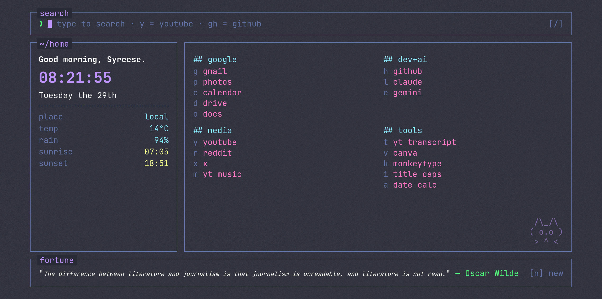
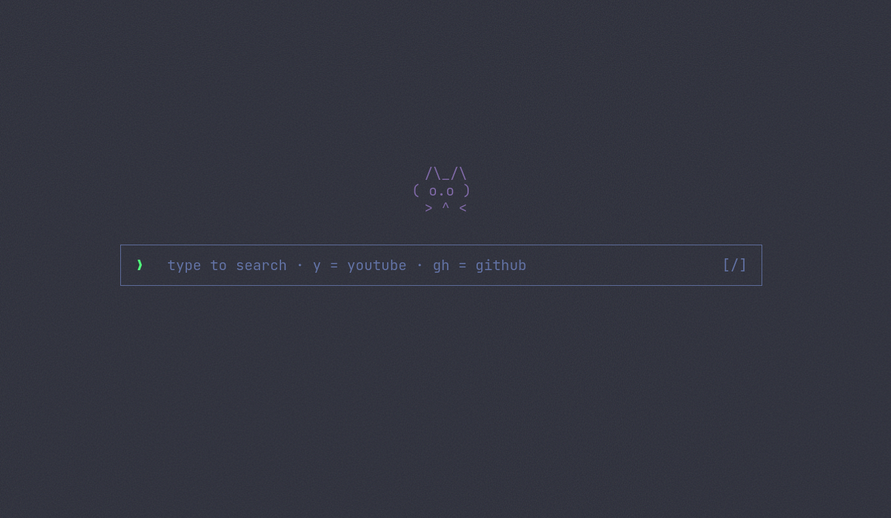

# home

A fast, keyboard-driven start page styled like a terminal TUI. Built to replace Firefox's new tab page — one HTML file, no build step, no tracking.

## Features

- **Live clock & date** with a time-based greeting
- **Weather** via [Open-Meteo](https://open-meteo.com/) — geolocates you automatically, falls back to New York
- **Random quotes** on load, with a one-key refresh
- **Quick-launch links** grouped by category, each with a single-key shortcut
- **Inline search bar** — plain text hits Google, `y <query>` hits YouTube, `gh <query>` hits GitHub
- Dracula color scheme, JetBrains Mono, subtle grain + hover glow

### Keyboard shortcuts

| Key | Action |
|---|---|
| `/` | Focus the search bar |
| `n` | Load a new quote |
| `Enter` (in search) | Run the search |

## Install

This is a static file — no dependencies, no build.

1. Download `index.html`
2. Open `about:preferences#home` in Firefox
3. Set **Homepage and new windows** to **Custom URL...** and point it at the local file path (e.g. `file:///path/to/index.html`)

Or just double-click `index.html` to preview it in any browser.

### New tabs (`minimal.html`)

Firefox's homepage setting only covers the homepage and new *windows* — it won't override new *tabs*, and it has no custom URL option for that. Getting a custom page on new tabs requires the [New Tab Override](https://addons.mozilla.org/en-US/firefox/addon/new-tab-override/) extension:

1. Install New Tab Override
2. In its settings, choose **Local file** and select `minimal.html`

New Tab Override runs pages in a restricted extension context — API calls and some scripts don't reliably work there. So `minimal.html` is a stripped-down page: just the ASCII cat and the search bar, no weather, quotes, or links. Use `index.html` for the homepage where the full version works, and `minimal.html` for new tabs.

## Customize

Everything lives in `index.html`:

- **Links** — edit the `LINK_GROUPS` array
- **Name** — edit the greeting string in `tick()`
- **Default location** — edit the fallback coordinates passed to `loadWeather()`
- **Colors** — edit the CSS variables at the top of `<style>`
